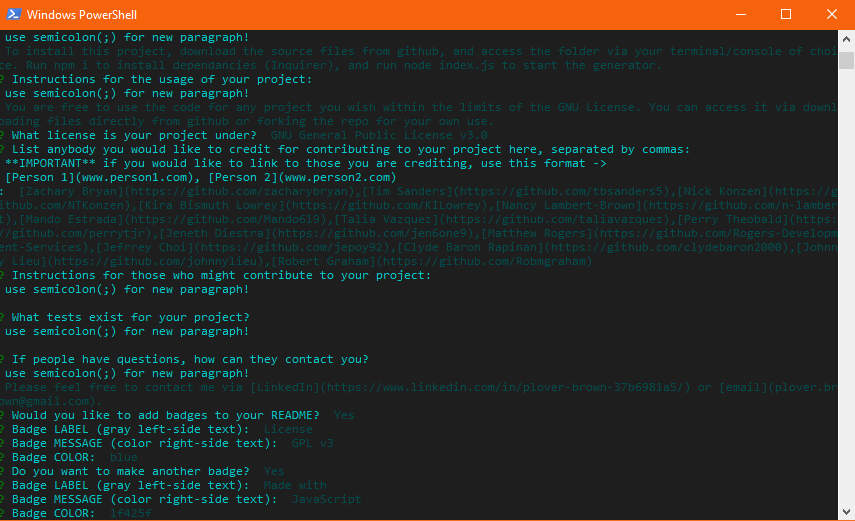

# Good README Generator

Find it on [GitHub](www.github.com/rebgrasshopper/goodREADMEgenerator)

Table Of Contents:

- [Section 1: Introduction](#introduction)
- [Section 2: Installation](#installation)
- [Section 3: Usage](#usage)
- [Section 4: License](#license)
- [Section 5: Credits](#credits)
- [Section 6: Contact](#contact)

## Introduction:

This project is a markdown README generator designed to run in a command terminal compatible with node. It offers a variety of standard readme sections, the ability to set up multiple paragraphs by separating text with a semicolon, the option to input a link to the deployed project and a filepath to a screenshot. It's created in JavaScript, with Inquirer dependancy.

## Installation:

To install this project, download the source files from github, and access the folder via your terminal/console of choice. Run npm i to install dependancies (Inquirer), and run node index.js to start the generator.

## Usage:

You are free to use the code for any project you wish within the limits of the GNU License. You can access it via downloading files directly from github or forking the repo for your own use.

## License:

GNU General Public License v3.0

## Credits:

As always, thanks to my coding co-op, and you can find some of 'em here:

- [Zachary Bryan](https://github.com/zacharybryan)
- [Tim Sanders](https://github.com/tbsanders5)
- [Nick Konzen](https://github.com/NTKonzen)
- [Kira Bismuth Lowrey](https://github.com/KILowrey)
- [Nancy Lambert-Brown](https://github.com/n-lambert)
- [Mando Estrada](https://github.com/Mando619)
- [Talia Vazquez](https://github.com/taliavazquez)
- [Perry Theobald](https://github.com/perrytjr)
- [Jeneth Diestra](https://github.com/jen6one9)
- [Matthew Rogers](https://github.com/Rogers-Development-Services)
- [Jefrrey Choi](https://github.com/jepoy92)
- [Clyde Baron Rapinan](https://github.com/clydebaron2000)
- [Johnny Lieu](https://github.com/johnnylieu)
- [Robert Graham](https://github.com/Robmgraham)

## Contact:

Please feel free to contact me via [LinkedIn](https://www.linkedin.com/in/plover-brown-37b6981a5/) or [email](plover.brown@gmail.com).

